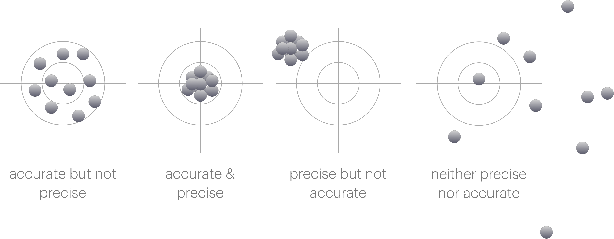

# How many significant figures are there? {#sec-chapter1}

## Before we begin... Precision and Accuracy.

In talking about significant figures, standard erro and propagation of error, we need to be clear about what we mean by precision and accuracy.

Data has a spread, in taking physical measurements this is not something we can avoid. How well we can record a value is frequently limited by the equipment we are using. We will talk more about this spread of data in later chapters of this resource.

::: {#tip-accuracyandprecision .callout-tip}

- Accuracy is how close a measurement is to the true value.
- Precision is how close a set of measurements are to each other.

:::

{fig-alt="Four targets each showing different combinations of accuracy and precision."}

When we are talking about significant figures, we are talking about precision. The more significant figures we have, the more precise our measurement is.

## Significant Figures

Often at school you haven't really thought about significant figures, but in science they are very important. The number of significant figures in a measurement is a measure of how precise that measurement is. The more significant figures, the more precise the measurement.

Therefore it is important that we don't ignore numbers which are significant, or report values to an undue number of significant figures.

Frequently the only way you have thought about significant figures in school is to report things like (2dp) after a value - usually because you have trunkated the value and you want to be clear you are reporting a trunkated value. However this is not appropriate for post school life. Nobody has ever written 2dp or 3sf after a value in a research paper.

::: {.callout-important title="Don't do this!"}
Never write 2dp or 3sf after a value. It is not appropriate in science and will make you look like you don't know what you are doing.

Instead just write your answer to the correct number of significant figures.
:::

Therefore we have to have have a way of understanding the significant figures we have, how to report them in an appropriate way, and then we will see in @sec-chapter2 how to use them in calculations.

::: {.callout-note title="Why we care about significant figures."}
Significant figures are a measure of our confidence in a value.

When we have many significant figures, we are more confident in the value. When we have few significant figures, we are less confident in the value.

Usually if we have any uncertaintiy in a value it is in the last significant figure we report.
:::

## How many significant figures are there?

Like many things in science, there are rules for how to determine the number of significant figures in a value. The rules are as follows:

::: {#tip-howmanysf .callout-tip}

- Any non-zero digit is significant
- Any 0 following a non-zero digit is significant
- Any 0 to the left of the first non-zero digit is not significant

:::

By saying that any 0 after another digit we avoid ambiguity. This may be different to what you have been taught in school.

Below are examples of numbers and how many significant figures they have.

::: {.callout-caution title="How many significant figures are there?"}

$\begin{array}{cc}
123 & 3 \textrm{ sf}\\
123.4 & 4 \textrm{ sf}\\
0.123 & 3 \textrm{ sf}\\
123400 & 6 \textrm{ sf}\\
123.4 \times 10^3 & 4 \textrm{ sf}
\end{array}$

:::

We should use standard form (or unit prefixes where appropriate) to represent values to an appropriate precision.

::: {.callout-important title="Don't do this!"}
Freqently in exams I will see answers such as:

$\Delta H =$ 123854.3628 J mol$^{-1}$

$\approx$ 124000 J mol$^{-1}$ (3sf)

This latter value is actually still written to 6 significant figures.

We do not need the $\approx$ sign as if are answer should be to three sig figs then the answer is correct to the correct number of significant figures. 

We should write the answer with a unit prefix (or in standard form) to avoid ambiguity.

$\Delta H =$ 124 kJ mol$^{-1}$
:::

# Exercise on counting signficant figures {#sec-exercise-sf}

## Making measurements and reading scales

When we record values in the laboratory we are limited by the precision of the instrumentation we are using. We ususally make decisions about equipment unconciously, for example you don't go seraching for a 4 decimal place balance to weigh out most reagents in the synthetic lab, but you frequently do this in the physical lab.

The balances are a good place to remind us that signficant zeros matter.

There is a big diference between 0.4 g and 0.4000 g in terms of our precision.

One thing that may be different to school is accepting that you cannot read a scale more accurately than the scale allows. 

Frequently in school you are told that if it is half way between the graduations on a burrette then you use an increased level of precision than the instrument allows. This is not appropriate in science. 

::: {#tip-scales .callout-tip}
You cannot read a scale more accurately than the scale allows.
:::

{fig-alt="A sketch of a burette with a meniscus bottom between 19.6 and 19.7 mL."}{width=40%}

In the case of the burette above, we can only read to 1 decimal place. If the meniscus is between 19.6 and 19.7 mL, we **cannot** report the value as 19.65 mL (as you may have been taught in school). This is because we are adding a precision we do not have. How do we know it is 19.65 mL and not 19.66 mL or 19.64 mL? We don't. Therefore we stick with the precision of the instrument.

In this case you either have to choose 'is it closer to 19.6 mL or 19.7 mL' and report the value as either 19.6 mL or 19.7 mL or to avoid systematic bias we *round to even*.

## Round to even

If we think about rounding we need to consider the possibility of systematic bias. If we always round up, then we will always be reporting a value that is higher than the true value. If we always round down, then we will always be reporting a value that is lower than the true value.

Consider the following values which we need to report to 1 decimal place:

::: {.callout-caution title="Rounding values?"}

$\begin{array}{ccc}
19.10 & 19.1 & \textrm{no rounding needed}\\
19.11 & 19.1 & \textrm{round down}\\
19.12 & 19.1 & \textrm{round down}\\
19.13 & 19.1 & \textrm{round down}\\
19.14 & 19.1 & \textrm{round down}\\
19.15 & 19.? & ???\\
19.16 & 19.2 & \textrm{round up}\\
19.17 & 19.2 & \textrm{round up}\\
19.18 & 19.2 & \textrm{round up}\\
19.19 & 19.2 & \textrm{round up}\\
19.20 & 19.2 & \textrm{no rounding needed}  \\
\end{array}$
:::

If we always round the value ending in a 5 up (as you maybe always have before) then we have more values rounding up than we have rounding ndown and we introduce a slight systematic bias increasing our value over all.

Therefore if a value ends exactly in a 5 and needs to be rounded we instead 'round to even', which should mean that half of the time it will round up and half of the time it rounds down.

::: {#tip-roundtoeven .callout-tip}
If a value ends in a 5 exactly and needs rounding we should round to the nearest even number.
:::

::: {.callout-caution title="Examples of rounding to even."}

If each of the following should be reported to 3 significant figures

$\begin{array}{cccc}
47.58 & \textrm{rounds up to} & 47.6 &\\
8.325 & \textrm{rounds down to} & 8.32 & \textrm{rounded to even}\\
3.621 & \textrm{rounds down to} & 3.62 &\\
64.55 & \textrm{rounds up to} & 64.6 & \textrm{rounded to even}\\
10.050003 & \textrm{rounds up to} & 10.5 &\\
\end{array}$

:::

## Values that are 'exact'.

In chemistry we have some physical constants which are defined to have no uncertainty in them. These are the physical constants from which we derive our base SI units (m, s, mol... etc).

In these case even though the value as written may have a defined number of significant figures we may consider these values as 'exact' or values that have infinite significant figures.

An example of this is the speed of light, $c$:

$c$ = 299 792 458 m s$^{-1}$

even though as reported it only has 9 significant figures because we have definied it to be exact (and base the unit of distance off this definition) then it has infinite significant figures.

There are other physical constants where this is also the case, for example those common in chemistry are Planck's constant, $h$,  the Boltzmann constant $k_B$, Avogadro's constant, $N_A$, and the charge on an electron, $e$.

Since both Avogadro's constant, $N_A$, and Boltzmann's constant $k_B$, are 'exact' values so is the gas constant, $R$.

Each of these constants is tabulated here and should be considered to have inifinite significant figures.

$\begin{array}{cc}
c & 299 792 458 \textrm{ m s}^{−1}\\
h & 6.626 070 15 \times 10^{−34} \textrm{ J s}\\
k_B & 1.380 649 \times 10^{−23} \textrm{ J⋅K}^{−1}\\
N_A & 6.022 140 76 \times 10^{23} \textrm{ mol}^{−1}\\
e & 1.602 176 634 \times 10^{−19} \textrm{ C}\\
R & 8.314 462 618 153 24 \textrm{ J K}^{-1} \textrm{ mol}^{-1}\\
\end{array}$

Another example of 'exact' values are integers, which may also be considered to have infinite signficant figures.

Finally we may 'define' for simplicity exact values. This is usually denoted by questions saying something is 'exact'. For example, exactly 2 mol of diethyl ether was burnt...

We will see calculations in Chapter @sec-chapter2 which use both exact and inexact values.

# Exercise write the following values to the listed sf.