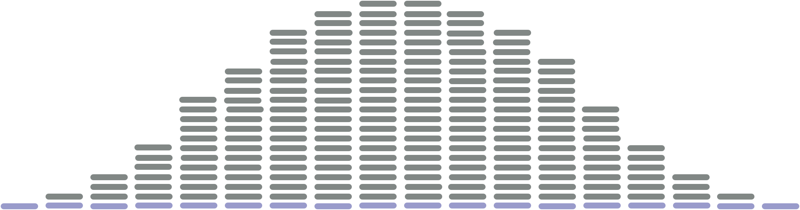
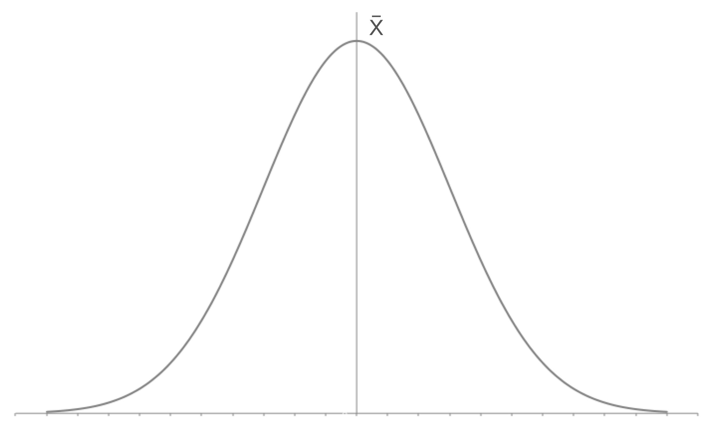
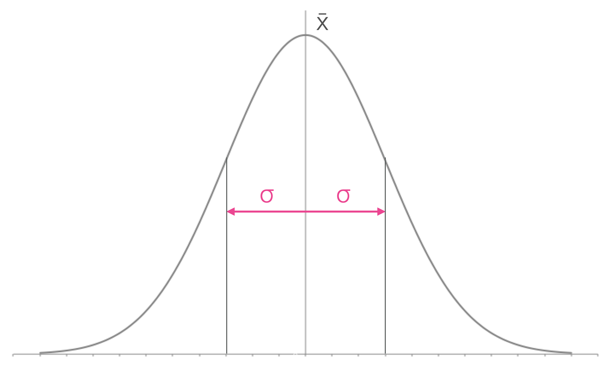
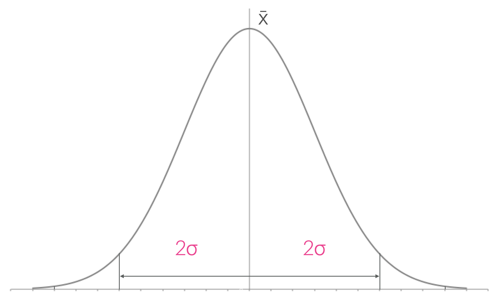
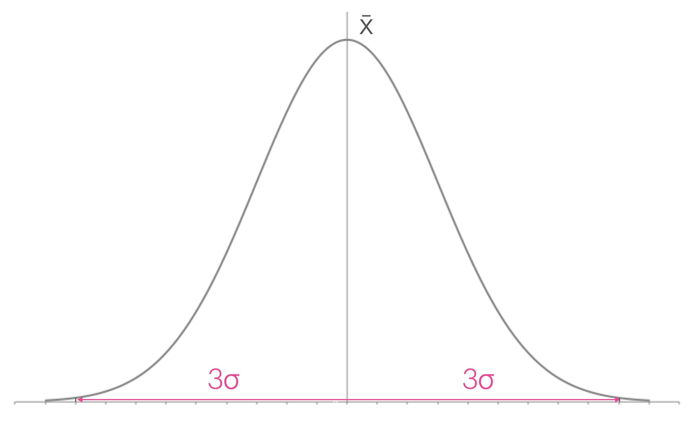
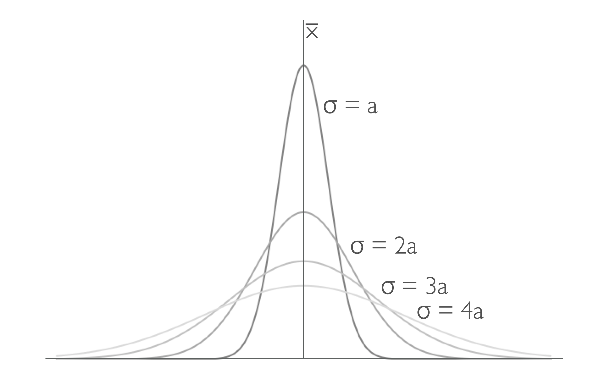

# Averages and standard deviation. {#sec-chapter3}

You are likely familiar with the concept of averages, and you may have heard of the standard deviation. In this chapter we will look at how to calculate averages and standard deviations, and how to report them to the appropriate number of significant figures.

It is important to remember that all data has a spread, we do not expect every measurement to be exactly the same no matter how careful we are. The spread of the data is a measure of the uncertainty in our measurements, and we can use that to calculate the standard error.

{#fig-dataspread fig-alt="A chart showing the spread of data where the data points are distributed around the mean."}

Your data being 'far' from the mean isn't a bad thing, it just means that you have collected  data that falls within the expected spread of the data. This distrubtion of data is why, as scientists, we take multiple measurements of the same thing. We want to be sure that our data is representative of the true value.

It is also why we take many measurements of the same thing, and then calculate an average value. The average value is a better representation of the true value than any single measurement.


You will notice from @fig-dataspread that the data points are symmetrically distributed around the mean. This is what we expect to see in Gaussian (sometimes called normal) distribution of data, you will likely have seen this distrubtion in school, or be familiar with the concept of standard deviation. When we calculate a standard deviation (and later a standard error) we are assuming that our data is normally distributed, and that the mean is a good representation of the data.

## Averages and the mean {#sec-averages}

### The mean {#sec-mean}

There are different types of average, but the one we are interested in, and the one you are probably most familiar with, is the mean. The mean is calculated by adding all the values together and dividing by the number of values.

:::{#tip-mean .callout-tip title="Calculating the mean, $\bar {x}$."}
$\bar{x} = \frac{\sum\limits_{i=1}^{N} x_i}{N}$
:::

The overline above the x indicates it is the mean of the x values,  we can use this notation for any variable, for example the mean of $\Delta T$ would be written as $\bar {\Delta T}$, or $\bar {\Delta _r H}$.

* When calculating the mean using Excel you can use the function '=AVERAGE()' to calculate the mean of a set of values.

* When calculating the mean using Python, you can use the `statistics.mean()`  or `numpy.mean()` function, after importing the necessary libraries.

When we calculate the mean we need to remember the rules for significant figures from @sec-chapter2. The mean is a calculated value, and therefore the number of significant figures in the mean is determined by the number of significant figures in the values we are averaging.

::: {.callout-caution title="Calculating the mean of a set of data."}
Determine the mean of the following set of data: $\Delta T$ / K : 10.33, 10.42, 10.41, 10.60, 10.57, 10.33, 10.49

$\bar {\Delta T} = 10.45$ K

$\bar{T} = \frac{\sum\limits_{i=1}^{N}T_i}{N}$

here N = 7, and $\sum\limits_{i=1}^{N}x_i = 73.15$ K

$\bar {\Delta T} = \frac{73.15 \textrm{ K}}{7} = 10.45$ K

:::


### The mid-range {#sec-midrange}

The mid-range is another type of average, which can be calculated very quickly to give you an estimate of the average value. 

:::{#tip-midrange .callout-tip title="Calculating the mid-range."}
$\text{Mid-range} = \frac{\text{Max value} + \text{Min value}}{2}$
:::


Like the mean our confidence in the mid-range increases with the number of data points we have collected. If we collect a large amount of data, the mid-range will be a good estimate of the mean. However if we have only collected a small amount of data, the mid-range will likely not be a good estimate of the mean.

Also like the mean, we cannot gain significant figures during our calculation.

In practice we don't use the mid-range very often, but it is a quick way to get an estimate of the mean value of a set of data in the lab.

::: {.callout-caution title="Calculating the mid-range of a set of data."}
Determine the mid-range of the following set of data: $\Delta T$ / K : 10.33, 10.42, 10.41, 10.60, 10.57, 10.33, 10.49

Aligning the data in increasing order we have: 

$\Delta T$ / K : 10.33, 10.33, 10.41, 10.42, 10.49, 10.57, 10.60

$\text{Mid-range} = \frac{\text{Max value} + \text{Min value}}{2}$

$\Delta T_{\textrm{Mid-range}} = \frac{10.60 \textrm{ K} + 10.33 \textrm{ K}}{2} = 10.46$ K

Here we have to maintain the number of significant figures in our calculation, so we report the mid-range to 2 decimal places, the same as the data we are using to calculate it. The answer has then been rounded to even.

:::


### Exercises calculating the mean and mid-range.

#### Self check on our learning so far. 

:::{.callout-note collapse="true"}
## Determine the mean of the following set of data: $\Delta _r H$ / kJ mol$^{-1}$ : -92.3, -87.4, -90.1

$\bar {\Delta _r H} = -89.9$ kJ mol$^{-1}$

$\bar {\Delta _r H} = \frac{\sum\limits_{i=1}^{N} \Delta _r H_i}{N}$

here $N$ = 3, and $\sum\limits_{i=1}^{N}\Delta _r H_i = -269.8$ kJ mol$^{-1}$

$\bar {\Delta _r H} = \frac{-269.8 \textrm{ kJ mol}^{-1}}{3} = -89.9$ kJ mol$^{-1}$

Note that we have had to round our answer to 1 decimal place, the same as the data we are using to calculate it.
:::


:::{.callout-note collapse="true"}
## Determine the mean of the following set of data: $k$ / $10^6$ s$^{-1}$ : 41.362, 36.52, 37.663, 40.92

$\bar {k} = 39.12 \times 10^6$ s$^{-1}$

$\bar {k} = \frac{\sum\limits_{i=1}^{N} k_i}{N}$

here $N$ = 4, and ${\sum\limits_{i=1}^{N} k_i} = 156.465 \times 10^6$ s$^{-1}$

$\bar {k} = \frac{156.465\times 10^6 \textrm{ s}^{-1}}{4} = 39.12 \times 10^6$ s$^{-1}$

Here some of our data has 2 decimal places and some 3 decimal places, our mean needs to reflect the lowest precision in our data, so should have 2 decimal places.
:::

:::{.callout-note collapse="true"}
## Determine the average of the following data: $\Delta T$ / K: 1.205, 1.193, 1.198, 1.204

$\bar {\Delta T}$ = 1.200 K

$\bar {\Delta T} = \frac{\sum\limits_{i=1}^{N} \Delta T_i}{N}$

here $N$ = 4, and $\sum\limits_{i=1}^{N} \Delta T_i = 4.800$ K

$\bar {\Delta T} = \frac{4.800 \textrm{ K} }{4} = 1.200$ K

Be careful to record significant zeros (even if your calculator, Excel or Python don't report them).

:::

:::{.callout-note collapse="true"}
## Determine the mid-range of the following set of data: $A$: 0.102, 0.097, 0.104, 0.100

$A_{\textrm{mid-range}} = 0.100$

$A_{\textrm{mid-range}} = \frac{A_\textrm{max} + A_\textrm{min}}{2}$

Putting the data in increasing order: 0.097, 0.100, 0.102, 0.104

So our $A_{\textrm{min}} = 0.097$ and our $A_{\textrm{max}} = 0.104$ 

$A_{\textrm{mid-range}} = \frac{0.097+0.104}{2} = 0.100$

Note here we have rounded our answer to even, so the 0.1005 rounds down when accomodating the correct number of significant figures. Again remember those significant zeros when writing down your answer.
:::


#### Self assessment questions on mean and mid-range.


## The standard deviation, $\sigma$ or $s$. {#sec-standarddeviation}

The following two sets of data share the same mean, and the same precision, but they are clearly very different sets of data:

* 9.0, 9.5, 10.0, 10.5, 11.0       $\bar {x} = 10.0$      $x_{min} = 9.0$, $x_{max} = 11.0$

* 9.8, 9.9, 10.0, 10.1, 10.2       $\bar {x} = 10.0$      $x_{min} = 9.8$, $x_{max} = 10.2$

So we need a method to describe the distribution, to help us understand the data.


The standard deviation is represented by the symbol $\sigma$ or $s$. These represent two subtly different forms of the standard deviation, the standard deviation of the population (where all possible measurements have been made), $sigma$, and the standard deviation of a sample of the population, $s$.

Our Gaussian distribution has a maximum at the mean and a symmetrical distribution around the mean.

::: {#fig-gaussian layout-ncol=2}

{#fig-sdmean fig-alt="A chart showing a Gaussian distribution with the mean marked at the distribution maximum."}

{#fig-sd1st fig-alt="A chart showing a Gaussian distribution with the first standard deviation marked."}

{#fig-sd2nd fig-alt="A chart showing a Gaussian distribution with the second standard deviation marked."}

{#fig-sd3rd fig-alt="A chart showing a Gaussian distribution with the third standard deviation marked."} 

The Gaussian distribution and distribution of data described by the standard deviation.
:::

When our data is precise our standard deviation is small.

The standard deviation is a measure of the spread of the data, and therefore a measure of the uncertainty in our measurements. This can be seen in @fig-sdspread which shows multiple Gaussian distributions with different standard deviations. The smaller the standard deviation, the more precise our data is.

The consequence of this larger standard deviation is that the mean value of the data becomes less obvious, and therefore our confidence in the mean value is reduced.

{#fig-sdspread fig-alt="A chart showing multiple Gaussian distributions with different standard deviations, the bigger the value of the standard deviation, the broader the distribution, as the number of data points is the same in each case the mean value falls, and becomes less obvious."}

If you have learned to calculate the standard deviation previously you will be aware that there are two different methods.

The first method is to calculate the standard deviation of a population, and the second method is to calculate the standard deviation of a sample. The difference between these two methods is that when we are calculating the standard deviation of a sample we divide by $N-1$ instead of $N$.

We do this because if we have only collected a sample of data, we are not as confident in the mean value of that data as we would be if we had collected all the data. Therefore we need to account for this by dividing by $N-1$ instead of $N$.

As the number of data points increases the difference between the two methods becomes less significant, and when we have a large number of data points the two methods give very similar results.

In practice we can never measure every possible value of a physical quantity, so we will always be calculating the standard deviation of a sample. Therefore we will always divide by $N-1$ when calculating the standard deviation.

:::{#tip-standarddeviation .callout-tip title="Calculating the standard deviation, $s$."}
In scientific measurements we should always calculate the sample standard devation, $s$.

$s = \sqrt{\frac{\sum\limits_{i=1}^{N} (x_i - \bar{x})^2}{N-1}}$
:::


For completeness the equation for the population standard deviation, $\sigma$ is:

$\sigma = \sqrt{\frac{\sum\limits_{i=1}^{N} (x_i - \bar{x})^2}{N}}$

although there is no reason we should use this version.

When calculating the standard deviation using Excel you can use the =stdev.s() (=stdev() also works). When using python you can use ```statistics.stdev()``` or ```numpy.std()```.

::: {.callout-caution title="Calculating the standard deviation of a set of data."}
Determine the appropriate standard deviation of the following set of data: $\Delta T$ / K : 10.33, 10.42, 10.41, 10.60, 10.57, 10.33, 10.49

$\bar{T} = \dfrac{\sum\limits_{i=1}^{N} T_i}{N}$

here N = 7, and $\sum\limits_{i=1}^{N} T = 73.15$ K

$\bar {\Delta T} = \frac{73.15 \textrm{ K}}{7} = 10.45$ K

We have taken a sample, and so we need to use the equation for sample standard deviation.

| $T$ / K | $\bar{T} - T$ / K | $(\bar{T} - T)^2$ / K$^2$ |
|:--:|:--:|:--:|
|10.33|-0.12|0.0144|
|10.42|-0.03|0.0009|
|10.41|-0.04|0.0016|
|10.60|0.15|0.0225|
|10.57|0.12|0.0144|
|10.33|-0.12|0.0144|
|10.49|0.04| 0.0016|
||$\sum\limits_{i=1}^{N}(x_i-\bar{x})^2=$|0.0698|

$s(\Delta T) = \sqrt{\frac{\sum\limits_{i=1}^{N} (T_i - \bar{T})^2}{N-1}}$

This notation ($s(\Delta T)$) indicates that the sample standard deviation is a function of the temperature difference, $\Delta T$.

$s = \sqrt{\frac{0.0698}{7-1}}$

$s = 0.11$ K

Note that the standard deviation is reported to the same number of decimal places as our data.

:::

Practically, calculating standard deviations by hand is anacronistic, so feel free to calculate these using Excel or python.


### Exercises calculating the standard deviation.

#### Self check on our learning so far.

:::{.callout-note collapse="true"}
## Determine the appropriate standard deviation of the following set of data: $\Delta _r H$ / kJ mol$^{-1}$ : -92.3, -87.4, -90.1 ($\sum\limits_{i=1}^{N} (\Delta _r H - \bar{\Delta _r H}) = 12.05$)

$s(\Delta _r H) = 2.5$

N = 3, $\sum\limits_{i=1}^{N} (\Delta _r H - \bar{\Delta _r H}) = 12.05$

$s(\Delta _r H) = \sqrt{\frac{\sum\limits_{i=1}^{N} (\Delta _r H - \bar{\Delta _r H})^2}{N-1}}$

We only have a small sample of data so we should use $N-1$ in our denominator.

$s(\Delta _r H) = \sqrt{\frac{12.05}{3-1}}$

$s(\Delta _r H) = 2.5$

Note: the standard deviation has been rounded to the same precision as the data.
:::

Attempt the following questions using either Excel or Python (or your calculator if you prefer).

:::{.callout-note collapse="true"}
## Determine the appropriate standard deviation of the following set of data: $A$: 0.102, 0.097, 0.104, 0.100

$s(A) = 0.003$

Again we should be using the sample standard deviation.

You should have used the =stdev.s() function if using excel and selected your data in the bracket.

If using python after importing your library (either statisticas or numpy) then in either the stdev function will calculate your standard deviation.

Note: the standard deviation has been rounded to the same precision as the data.
:::

